# Digital Upconversion (DUC)

## Introduction

This example demonstrates a Digital Upconversion (DUC) algorithm implemented on AI Engine (AIE) devices.

## Algorithm

The DUC design consists of multi-stage finite impulse rate (FIR) filters, a direct digital synthesizer (DDS) and a mixer. 

 

The DUC specification is as follows:
* The input is a complex data input (I/Q) sample, which can be a QAM symbol, and the output is a continuous stream of real sample.
* The output rate of the DUC (Fo) is set to the processing clock rate (Fclk). The relationship from the input symbol rate (Fb) to the output rate is: Fo = 16 * Fb = Fclk.
* 4 stages of FIR filter, with interpolation ratio of 2 in each stage and the overall interpolation ratio of 16.
* The first stage is a 64 tap square raised root cosine (SRRC) filter, and the next three stage filters are half-band (HB) interpolate by 2 FIR filter. 

## Example Model

The example model compares a Simulink implementation of the DUC with two AI Engine implementations, one using Buffer interfaces between kernels, the other using Stream interfaces.

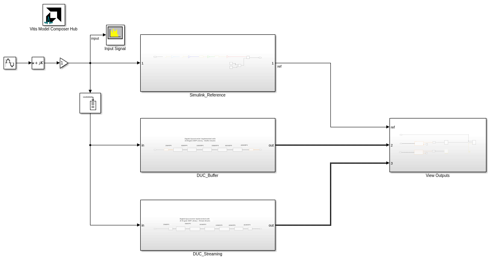 

The input to all 3 designs is a 1 MHz complex sinusoid with a sample rate of 25 MSPS.

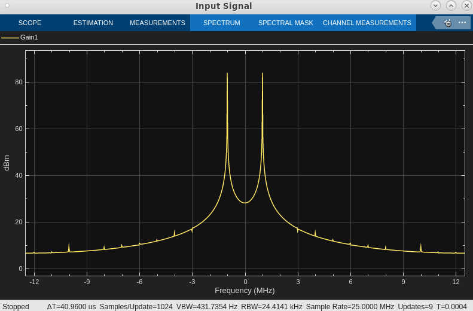 

### Simulink Reference Design

In the reference design, the 4 filter stages are implemented with Simulink's **FIR Interpolation** block.

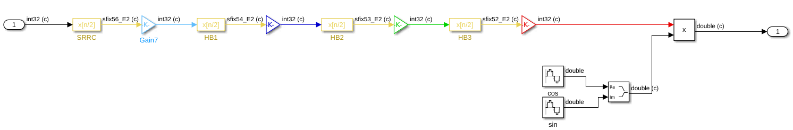 

The **Gain** blocks between each stage control bit growth and ensure that the input to each filter is 32 bits.

### AI Engine DUC Design

The AI Engine design is implemented using FIR interpolator and mixer blocks from the AI Engine DSP library.

 

Note that the AI Engine design has a single sample time in Simulink, but the signal dimensions increase as data flows through the filters (from 32 samples up to 512 samples, up to each stage). This effectively models the filter's interpolation; more data is being transferred in the same time period.

The PLIO blocks indicate that 64 bits are transferred on each PL clock cycle. With a PL clock frequency of 500 MHz and `int32` data type, this yields a maximum data rate of 1 GSPS. This easily satisfies the desired output sample rate of 400 MSPS.

Two versions of the AI Engine design are provided. They are identical, except one uses DSP library blocks with streaming interfaces, while the other uses DSP library blocks with buffer interfaces.

## Results

### DUC Output

The DUC upconverts the 1 MHz complex sinusoid with a sample rate of 25 MSPS to a 75 MHz signal with a sample rate of 400 MSPS. The buffer and streaming implementations are compared to the Simulink golden reference model.

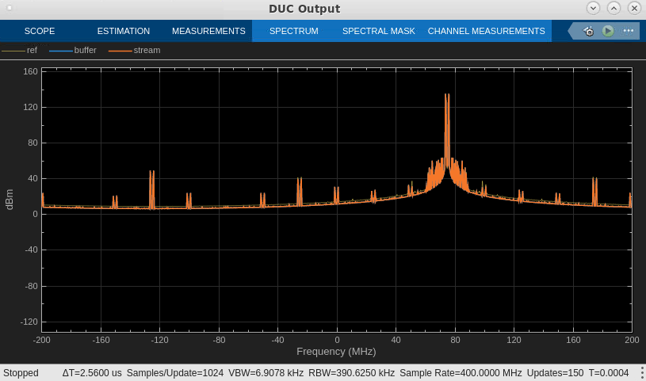 

### Throughput

Both the buffer and streaming implementation are able to achieve the desired throughput of 400 MSPS.

To run cycle-approximate AIE simulation and display the calculated throughput, use the **Analyze** tab in the **Vitis Model Composer Hub** block.

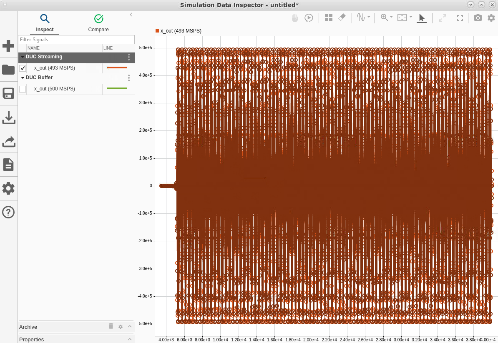 

### Latency

The latency of the AI Engine design can be viewed in the Vitis Analyzer. Select the AI Engine's input and output (use **Shift+Click** to select multiple signals), right-click and select **Compute Latency**.

#### Buffer

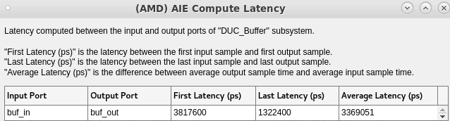

#### Streaming

Focusing on the Last Latency (indicating steady state operation of the DUC), the streaming implementation has lower latency than the buffer implementation.

### Resource Utilization

The buffer and streaming implementations differ in resource utilization. The differences are apparent in the graph view and resource utilization reports, which can be viewed in Vitis Analyzer. 

#### Buffer

Each filter and the mixer are implemented on their own AI Engine kernel. This could be viewed as an inefficiency, given that some of the kernels have low runtime ratios and could be combined onto a single kernel. (View the runtime ratios on the **Kernels** tab in Vitis Analyzer.) You could specify lower runtime ratios for each kernel as AI Engine constraints, and this information would be used by the AI Engine compiler.

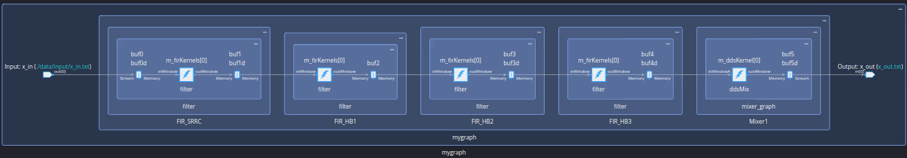

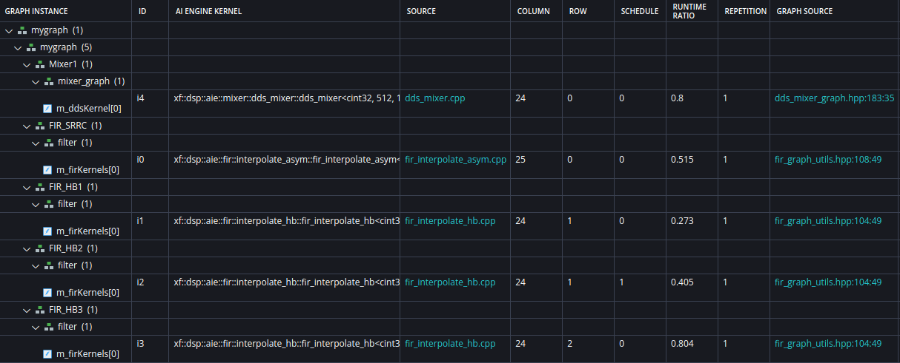   

This implementation of the DUC uses 5 AI Engine tiles.

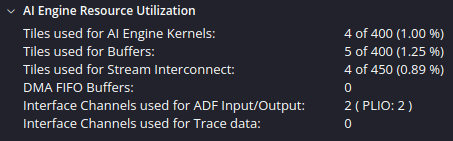

#### Streaming

This implementation has 4 cascade stages on the 1st interpolation filter and 2 cascade stages on the 2nd filter.

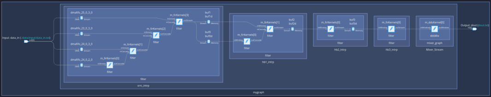 

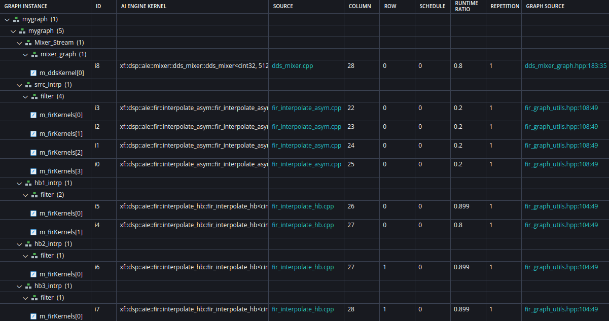 

This cascaded, streaming implementation of the DUC uses 13 AI Engine tiles.

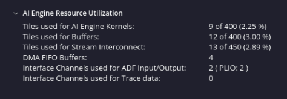 

## Conclusion

The AI Engine DSP Library, accessible in Vitis Model Composer, can be used to quickly experiment with different architectures for various signal processing algorithms, including Digital Upconversion (DUC).

------------
Copyright (c) 2024 Advanced Micro Devices, Inc.