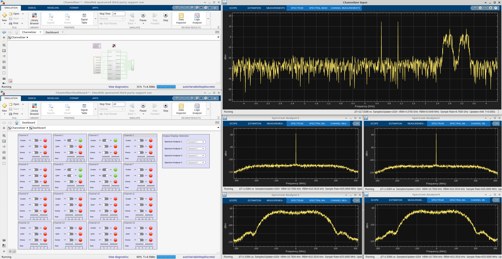

# Polyphase Channelizer

***Version: Vitis Model Composer 2024.2***

## Table of Contents

1. [Introduction](#introduction)
2. [Channelizer Requirements](#channelizer-requirements)
2. [Channelizer Implementation](#channelizer-implementation)
3. [MATLAB Model](#matlab-model)
4. [Simulink Model](#simulink-model)
5. [Functional Verification](#functional-verification)
6. [Conclusion](#conclusion)

[References](#references)

## Introduction

The polyphase channelizer [[1]] down-converts simultaneously a set of frequency-division multiplexed (FDM) channels carried in a single data stream using an
efficient approach based on digital signal processing. Channelizer use is ubiquitous in many wireless communications systems. Channelizer sampling rates increase 
steadily as the capabilities of RF-DAC and RF-ADC technology advances, making them challenging to implement in high speed reconfigurable devices such as field programmable
gate arrays (FPGAs). This example implements a high-speed channelizer design using a combination of AI Engine and Programmable Logic (PL) resources in Versal devices. 

To aid in simulation and verification, the AI Engine and Programmable Logic parts of the design are brought into Vitis Model Composer, which enables functional simulation of the AI Engine and PL components together.

## Channelizer Requirements

The table below shows the system requirements for the polyphase channelizer. The input sampling rate is 8.75 Gsps. The design supports M=16 channels with each one supporting 8.75G / 16 = 546.8765 MHz of bandwidth. The channelizer employs a polyphase technique as outlined in [[1]] to achieve an oversampled output at a rate of P/Q = 8/7 times the channel bandwidth, or 546.8765 * 8/7 = 625 Msps. The prototype filter used by the channelizer uses K=8 taps per phase, leading to a total of 16 x 8 = 128 taps overall.

|Parameter|Value|Units|
|---|---|---|
| Input Sampling Rate (Fs) | 8.75 | Gsps |
| # of Channels (M) | 16 | channels |
| Interpolation Factor (P)| 8 | n/a |
| Decimation Factor (Q) | 7 | n/a |
| Channel Bandwidth | 546.8765 | MHz |
| Output Sampling Rate | 625 | Msps |
| # of taps per phase (K) | 8 | n/a |

*Polyphase Channelizer System Requirements.*

## Channelizer Implementation

The figure below shows a block diagram of the polyphase channelizer. The polyphase channelizer consists of the following functions:
* The **Circular Buffer** converts the scalar input data stream into an M-vector output format for the downstream blocks, and introduces state to manage the P/Q output oversampling.   
* The **Polyphase Filter** implements a parallel bank of M filters, each with K = 8 coefficients. The filter produces a single vector of M output samples.
* The **Cyclic Shift Buffer** removes frequency-dependent phase shifts from the downstream Inverse Discrete Fourier Transform (IDFT) outputs using a memoryless and periodically time-varying circular shift of its inputs. 
* The **Inverse Fast Fourier Transform (IFFT)** performs an IDFT operation on its input vector of M samples to produce a transformed vector of output samples. Each IDFT output represents a separate down-converted channel of bandwidth Fs / M sampled at a rate of Fs / M * P / Q samples per second.

*Polyphase Channelizer Block Diagram.*

For a more detailed description of the implementation, refer to [Polyphase Channelizer](https://github.com/Xilinx/Vitis-Tutorials/tree/2024.2/AI_Engine_Development/AIE/Design_Tutorials/04-Polyphase-Channelizer) in [Vitis-Tutorials](https://github.com/Xilinx/Vitis-Tutorials). 

The remainder of this example will focus on how to bring the polyphase channelizer implementation into Vitis Model Composer and simulate it.

## MATLAB Model

The figure below shows a system model of the polyphase channelizer built in MATLAB and encapsulated in a MATLAB app. This provides a comprehensive golden model of the channelizer algorithms and illustrates the relationships between the various system parameters. The model was built to support a different, broader range of parameter settings than the actual Versal design:
* The model supports two different input sampling rates, Fs = 10.5 Gsps and Fs = 20.5 Gsps.
* The number of channels M may be set to 16, 32, 64, or 128 using a dial.
* The output oversampling ratio P/Q may be set to 1/1, 2/1, 4/3, or 8/7 using the appropriate button.
* The number of active channels may be entered in the bottom left. This value must be less than the chosen value of M.

*Polyphase Channelizer system model implemented as a MATLAB app.*

To run the MATLAB polyphase channelizer model:

1. Navigate to the **app** folder.

2. Run `channelizer`.

3. Specify the **Oversampling Ratio**, **Number of Channels**, **Sampling Frequency**, and **Number Active** according to the figure above.

4. Click **Go**.

When this occurs, the model generates the desired number of active channels and positions them in randomly chosen carrier locations. Each signal is modeled as filtered Gaussian noise for simplicity. The model displays the impulse response of the prototype channelizer filter computed for the given system parameters in the top left plot. The bottom left plot shows this same filter in the frequency domain in red along with the actual signal to be extracted by the channelizer in blue. The top right plot shows the input spectrum to the channelizer along with the active carriers and their index labels. The bottom right plot shows the extracted channels at baseband in the time domain, where the blue signals are the channelizer inputs (delayed by the known group delay of the channelizer) and the red signals are the channelizer outputs.

## Simulink Model

To aid in simulation and verification, the AI Engine graph code and HLS kernel code are brought into Vitis Model Composer, which enables functional simulation of the AI Engine and PL components together.

The `aie` and `hls` folders contain separate Simulink models for evaluating and studying the operation of each AI Engine graph and HLS kernel in isolation. In particular, the `Channelizer_DFT_testbench` model can be used to observe the permutation on the input and output streams to and from the AI Engine DFT implementation.

1. Open the Simulink model `Channelizer.slx`.

2. Press **Ctrl+D** to update the model and display signal dimensions and data types.

The inputs and outputs of the channelizer are 16 bits wide with 15 bits of fractional precision. The floating-point channelizer inputs from the MATLAB workspace are scaled by 2^15 and converted to an `int16` data type. The channelizer outputs are scaled by 2^-15 to convert back to floating-point precision before being written to the MATLAB workspace.

Note also that the inputs and outputs are 4 elements wide. This is because 128 bits of data (4 complex `int16` samples) can be transferred to and from the design on each stream and sample.

3. Double-click on the **DUT** subsystem.

The model shows the partitioning of the design between the AI Engine and PL. The channelizer input enters the input permute HLS Kernel at the upper-left, then proceeds into the AI Engine for polyphase filter processing. The polyphase filter output is routed back to the PL for the output permute and cyclic shift operations. The cyclic shift output is routed back to the AI Engine for the DFT operation, from which the output exits the channelizer.

Note the use of **AIE to HLS** and **HLS to AIE** blocks before and after the HLS kernels. The HLS kernels' inputs and outputs are 128 bits wide, so these blocks convert between a 4-element `cint16` vector (recognized by the AI Engine) and a single `uint128` value.

### AI Engine Implementation

The polyphase filter and DFT are implemented as separate AI Engine subsystems. Inside each subsystem, each kernel has been brought in to Vitis Model Composer using the **AIE Class Kernel** block.

4. Double-click on the **AIE** subsystem.

Each input and output stream has a 64-bit PLIO. This means that 2 `cint16` samples are transferred on each stream during each clock cycle. To achieve high throughput, the AI Engine design is implemented using a Super Sample Rate (SSR) parallel architecture. Refer to [Polyphase Channelizer](https://github.com/Xilinx/Vitis-Tutorials/tree/2024.2/AI_Engine_Development/AIE/Design_Tutorials/04-Polyphase-Channelizer) in Vitis-Tutorials for further details on the parallel architecture.

5. Double-click on the **m16_ssr8_dft** subsystem.

Each **AIE Class Kernel** block represents a kernel that will execute on its own AI Engine tile. The design consists of a 4x4 array of tiles. Each tile performs two [1x2] x [2x4] operations over two cycles. Each row of tiles passes its computed outputs to the tile below in the same column using the cascade stream. For more details, refer to [Vitis-Tutorials](https://github.com/Xilinx/Vitis-Tutorials/tree/2024.2/AI_Engine_Development/AIE/Design_Tutorials/04-Polyphase-Channelizer#discrete-fourier-transform-design).

6. Double-click on the **run_inputA** block.
   

The **Function Declaration** indicates that this block executes the `run_input` function, with two stream inputs and one cascade output. 

The **Signal size** of the cascade output must be set by the user. Signal Size is a block mask property associated with each stream or cascade output of an imported AI Engine block. This property is used only in Simulink simulation and is not reflected in the generated code. This value is always set as samples and not bytes. For more information, see [Setting Signal Size](https://github.com/Xilinx/Vitis_Model_Composer/tree/2024.2/QuickGuides/Setting_Signal_Size).

In this case, the **Signal size** parameter is set to 8 times the number of samples processed, reflecting the SSR=8 nature of the algorithm.

7. Click on the **Kernel Class** tab.

The kernel has template parameters for the input data type, coefficient data type, and the total number of samples of the DFT. The filter coefficients are passed as parameters to the kernel class constructor. The coefficient values are stored in the MATLAB workspace variables `twidA0` and `twidA1`.

8. Click on the **General** tab.

Here is where the kernel header and source code files, and the kernel function, are specified.

Optionally, you can also double-click on the other kernels in the DFT to observe how they are configured. You can also double-click on the **m16_ssr8_filterbank** subsystem to observe its structure.

### Programmable Logic (PL) Implementation

The PL portion of the polyphase channelizer design contains 3 IPs that perform the following functions:

* Input Circular Buffer 
* Output Permute
* Cyclic Shift Buffer

These functions are explained in greater detail in [Polyphase Channelizer](https://github.com/Xilinx/Vitis-Tutorials/tree/2024.2/AI_Engine_Development/AIE/Design_Tutorials/04-Polyphase-Channelizer).

These blocks are implemented in PL using HLS @ 625 MHz. With 2 samples transferred in each PL clock cycle, the AI Engine is able to operate at a rate of 1250 MHz.

Each function is imported into Vitis Model Composer using the **HLS Kernel** block.

8. Return up to the **DUT** subsystem.

9. Double-click on the **m16_ssr8_permute_fb_i_wrapper** block, which implements the Input Circular Buffer.

Note that each output has a Signal size of N uint128 sample. As mentioned earlier, this corresponds to N*4 cint16 samples. 

10. Click on the **General** tab.

This tab provides the path to the HLS source code for the input circular buffer kernel. Click the  icon next to the path to view the kernel source code.

11. Click **Cancel** to close the window without making changes.

Optionally, you can double-click on the two remaining HLS Kernel blocks to observe that they are configured similarly.

## Functional Verification

The functional correctness of the channelizer can be evaluated by running the Simulink model.

1. Right-click the **Dashboard** block and select **Open in New Window**.

2. Arrange the model, dashboard, and scopes as desired.

3. Click **Run** on the Simulink toolstrip.

This model implements a 16-channel channelizer. The dashboard can be used to control the input signal to the channelizer. Each of the 16 channels can be configured in terms of:

* Enabled/Disabled
* Modulation (QAM) Enabled/Disabled
* Frequency Sweep Enabled/Disabled
* Rate of the Frequency Sweep

The dashboard can also be used to select which channelizer outputs are displayed on each of the spectrum analyzers.

You can interact with the dashboard while the model is running and see how the channelizer adjusts to the input signal changes.

## Estimating Throughput

Vitis Model Composer can call `aiesimulator` to simulate and plot the estimated throughput of the design.

1. Set the Simulink simulation **Stop Time** to `1e-5`.

1. On the top level of the model, double-click the **Model Composer Hub** block.

2. Select the **AIE** subsystem, then click on the **Analyze** tab. Ensure that the settings are as follows. 

4. Click **Analyze**.

After code generation, AIE simulation is performed. This is a cycle-approximate simulation that can be used to estimate throughput. 

5. When AIE simulation is complete, click **View AIE Simulation output and throughput**.

The results are displayed in the Simulation Data Inspector. Note that the throughput on each of the 8 output streams is approximately 1250 MSPS. It takes 2 clock cycles for the 8 output streams to produce a 16-point DFT output. Therefore, the DFT updates at a rate of 625 MHz, for which the channelizer was designed. 

---

## Conclusion

This example showcased the following capabilities of Vitis Model Composer for Versal development:

1. Import AI Engine and HLS source code into Vitis Model Composer.
2. Model data exchange between AI Engine and PL in simulation.
3. Simulate AI Engine and PL together in a single design.
4. Compare a Versal hardware code implementation to a MATLAB golden reference.

---
## References

[1]: <https://ieeexplore.ieee.org/document/1193158> "Digital Receivers and Transmitter Using Polyphase Filter Banks for Wireless Communications, F.J. Harris et. al."

[[1]] F.J. Harris et. al., "[Digital Receivers and Transmitter Using Polyphase Filter Banks for Wireless Communications](https://ieeexplore.ieee.org/document/1193158)", IEEE Transactions on Microwave Theory and Techniques, Vol. 51, No. 4, April 2003.

------------
Copyright (c) 2024 Advanced Micro Devices, Inc.

Licensed under the Apache License, Version 2.0 (the "License");
you may not use this file except in compliance with the License.
You may obtain a copy of the License at

    http://www.apache.org/licenses/LICENSE-2.0

Unless required by applicable law or agreed to in writing, software
distributed under the License is distributed on an "AS IS" BASIS,
WITHOUT WARRANTIES OR CONDITIONS OF ANY KIND, either express or implied.
See the License for the specific language governing permissions and
limitations under the License.