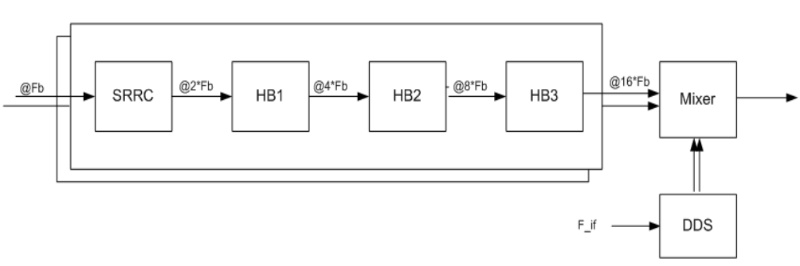
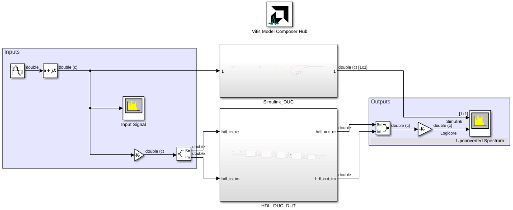
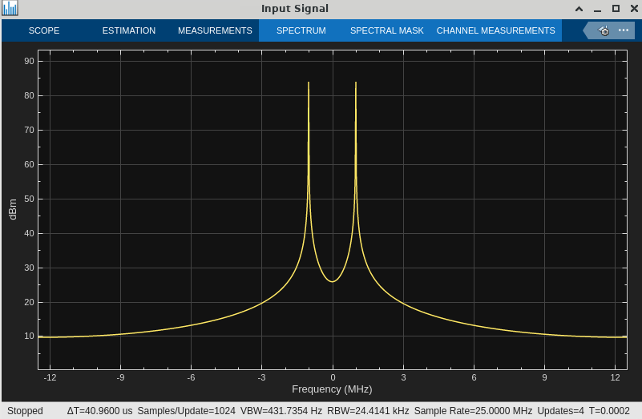
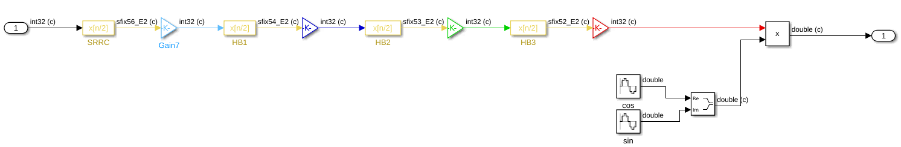
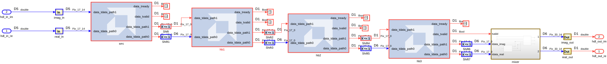
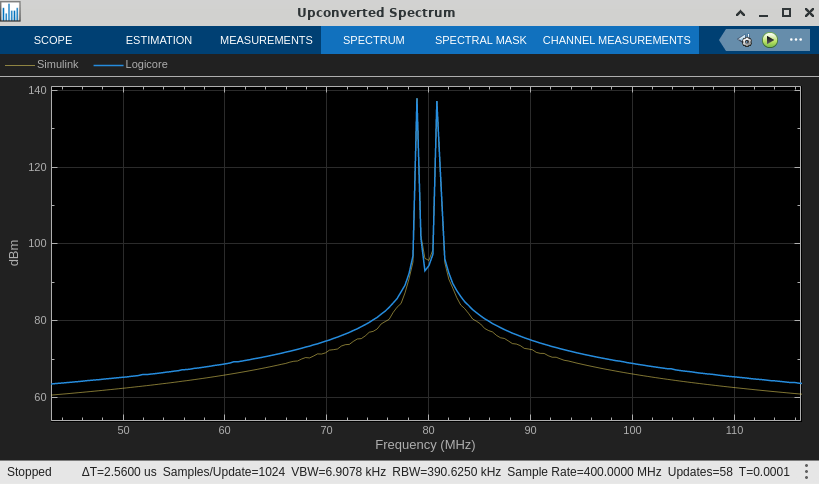
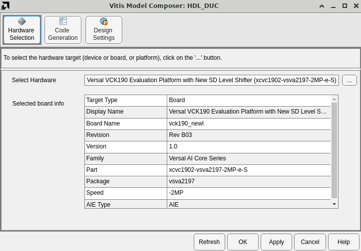
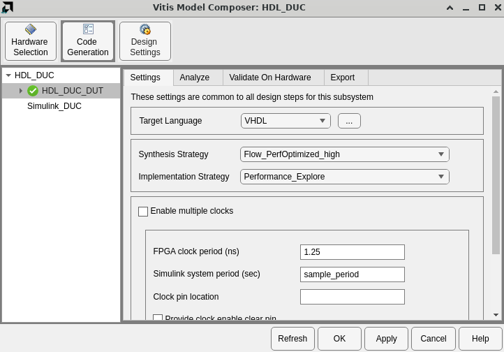
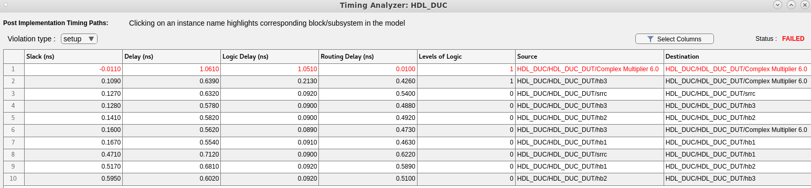
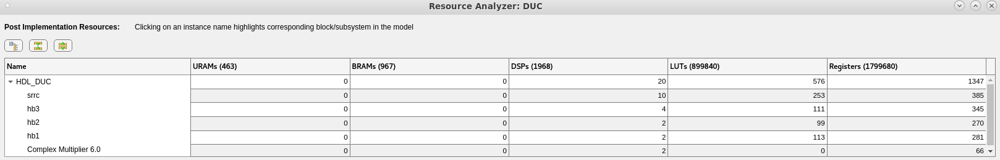

# Digital Upconversion (DUC)

## Introduction

This example demonstrates a Digital Upconversion (DUC) algorithm implemented on Programmable Logic using AMD IP blocks.

## Algorithm

The DUC design consists of multi-stage finite impulse rate (FIR) filters, a direct digital synthesizer (DDS) and a mixer. 

 

The DUC specification is as follows:
* 4 stages of FIR filter, with interpolation ratio of 2 in each stage and an overall interpolation ratio of 16.
* The first stage is a 64 tap square raised root cosine (SRRC) filter, and the next three stage filters are half-band (HB) interpolate by 2 FIR filters. 

## Example Model

The example model compares a Simulink implementation of the DUC with an HDL implementation.

 

The input to both designs is a 1 MHz complex sinusoid with a sample rate of 25 MSPS.

 

### Simulink Reference Design

In the reference design, the 4 filter stages are implemented with Simulink's **FIR Interpolation** block.

 

The **Gain** blocks between each stage control bit growth and ensure that the input to each filter is 32 bits.

The floating-point coefficients for each filter are stored in the MATLAB variables  `srrc`, `hb1`, `hb2`, and `hb3`. 

### PL DUC Design

The PL design is implemented using the FIR Compiler, DDS Compiler, and Complex Multiplier blocks from the **HDL/DSP/AXI-S** library.

 

The **Shift** blocks between each stage control bit growth and ensure that the input to each filter is 17 bits.

The fixed-point coefficients for each filter are stored in the MATLAB variables  `srrc_coeff`, `hb1_coeff`, `hb2_coeff`, and `hb3_coeff`. The coefficients are quantized to fit in the 17 bit coefficient width specified by the FIR Compiler blocks. Refer to `coeffs_scaling.m` to see the original (Simulink floating-point) coefficients and how they are quantized to 17 bits for PL implementation.

## Results

### DUC Output

The DUC upconverts the 1 MHz complex sinusoid with a sample rate of 25 MSPS to a 80 MHz signal with a sample rate of 400 MSPS. The PL implementation is compared to the Simulink golden reference model.

 

### Hardware Implementation

In the **Vitis Model Composer Hub** block, the selected hardware is a Versal VCK190 evaluation platform. This board contains a Versal AI Core `xcvc1902-vsva2197-2MP-e-S` part with `-2MP` speed grade.

 

Also note on the **Code Generation->Settings** tab that the design is configured for an FPGA clock period of 1.25 ns (rate of 800 MHz). This clock constraint will be passed to Vivado for implementation.

 

### Timing Closure

To determine whether or not the design will meet timing, run Timing Analysis from the **Analyze** tab. After running Vivado Synthesis and Implementation, the **Timing Analyzer** window will display the post implementation critical paths of the design.

 

The analysis indicates the most critical path fails to meet 800 MHz timing by 10 ps. This effectively meets timing due to conservative timing estimates in the speed files that describe the Versal AI Core device.

### Resource Utilization

To determine the FPGA resources the design will use, run Resource Analysis from the **Analyze** tab. After running Vivado Synthesis and Implementation, the **Resource Analyzer** window will show the various resources (URAM, BRAM, DSP, LUT, registers) used by each component of the design.

 

The architecture (17 bit inputs and 17 bit coefficients) of each filter allows them to map to the dedicated [DSP58](https://docs.amd.com/r/en-US/ug1485-versal-architecture-premium-series-libraries/DSP58) resources in the Versal device. 

## Conclusion

AMD PL IP blocks, accessible in Vitis Model Composer, can be used to implement high performance signal processing algorithms, including Digital Upconversion (DUC). Vitis Model Composer can be used to analyze their timing and resource requirements.

------------
Copyright (c) 2024 Advanced Micro Devices, Inc.